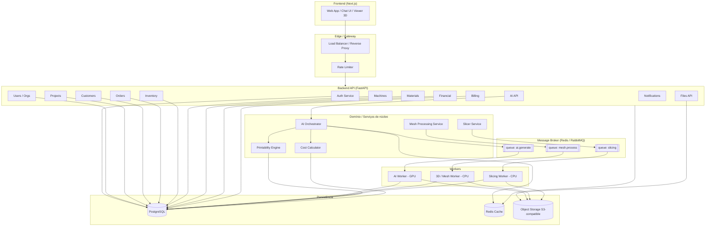
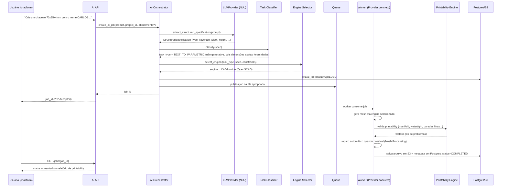

# 3D AI Studio — Arquitetura

Documento de arquitetura para aprovação. Nenhum módulo será implementado antes da aprovação explícita deste documento e do [DATABASE.md](DATABASE.md).

## Índice

1. [Visão geral do produto](#1-visão-geral-do-produto)
2. [Princípio de independência de modelo de IA](#2-princípio-de-independência-de-modelo-de-ia)
3. [Diagrama de arquitetura geral](#3-diagrama-de-arquitetura-geral)
4. [Stack tecnológica](#4-stack-tecnológica)
5. [Estrutura de diretórios](#5-estrutura-de-diretórios)
6. [Multi-tenancy](#6-multi-tenancy)
7. [Autenticação e RBAC](#7-autenticação-e-rbac)
8. [AI Orchestrator](#8-ai-orchestrator)
9. [Interfaces dos AI Providers](#9-interfaces-dos-ai-providers)
10. [Pipeline 3D](#10-pipeline-3d)
11. [Mesh Processing](#11-mesh-processing)
12. [Printability Engine](#12-printability-engine)
13. [Slicer Engine](#13-slicer-engine)
14. [Calculadora de custos](#14-calculadora-de-custos)
15. [Filas e Workers](#15-filas-e-workers)
16. [Estratégia de GPU / Compute](#16-estratégia-de-gpu--compute)
17. [Storage](#17-storage)
18. [API](#18-api)
19. [Segurança](#19-segurança)
20. [Observabilidade](#20-observabilidade)
21. [Estratégia de testes](#21-estratégia-de-testes)
22. [Docker / Ambiente local](#22-docker--ambiente-local)
23. [Roadmap de implementação](#23-roadmap-de-implementação)
24. [Riscos técnicos](#24-riscos-técnicos)
25. [Dependências e licenças a verificar](#25-dependências-e-licenças-a-verificar)

---

## 1. Visão geral do produto

**3D AI Studio** é uma plataforma SaaS multi-tenant que atua como copiloto de produção 3D. O usuário conversa em linguagem natural (ou usa formulários guiados) para criar, converter, reparar e precificar peças 3D, e administra o negócio de impressão 3D (clientes, pedidos, estoque, impressoras, financeiro) a partir do mesmo painel.

Princípios de design que orientam todas as decisões abaixo:

- **Determinismo onde importa.** Cálculos financeiros, geometria e regras de negócio nunca dependem de um LLM — LLMs interpretam intenção e texto, mas não calculam preço nem validam malha.
- **Abstração de motor de IA.** Nenhum código de aplicação chama um SDK de modelo de IA diretamente; tudo passa por uma interface de provider.
- **Assíncrono por padrão.** Qualquer operação que possa levar mais de ~1s (geração 3D, reparo de malha, slicing) é um job em fila, nunca uma chamada HTTP síncrona.
- **Multi-tenant desde o schema.** Isolamento por `organization_id` é uma regra de banco, não uma convenção de código.
- **Substituível.** Providers de IA, slicers e métodos de pagamento devem poder ser troncados sem reescrever módulos vizinhos.

## 2. Princípio de independência de modelo de IA

```
AI ORCHESTRATOR
      │
      ├── ImageTo3DProvider   → Hunyuan3D | TRELLIS | Stable Fast 3D | SPAR3D | ...
      ├── TextTo3DProvider    → Hunyuan3D-Text | modelo futuro
      ├── CADProvider         → OpenSCAD Engine | build123d Engine
      ├── MeshRepairProvider  → PyMeshLab | Blender headless | trimesh
      ├── TextureProvider     → modelo futuro
      └── SlicerProvider      → PrusaSlicer CLI | OrcaSlicer CLI | Cura CLI
```

Cada provider implementa uma interface Python (`Protocol`/ABC) definida no domínio (`domain/ai/ports.py`), nunca importa um SDK de terceiros fora de `infrastructure/ai_providers/<provider>/`. O AI Orchestrator só conhece a interface. Ver [seção 9](#9-interfaces-dos-ai-providers).

## 3. Diagrama de arquitetura geral



**Camadas:**

1. **Frontend** — Next.js/React, consome apenas a API REST/WebSocket versionada. Nunca acessa banco ou storage diretamente (exceto URLs pré-assinadas de download/upload).
2. **API/Backend** — FastAPI, organizado por módulos de domínio (seção 5). Responsável por autenticação, autorização, validação, orquestração leve e enfileiramento de jobs pesados.
3. **Core/Domínio** — regras de negócio puras (AI Orchestrator, Mesh Processing, Printability, Slicer, Calculadora), testáveis sem I/O externo.
4. **Queue** — todo trabalho pesado é publicado como job; a API nunca bloqueia esperando geração 3D.
5. **Workers** — processos separados (podem escalar independentemente, inclusive em máquinas com GPU dedicada).
6. **Persistência** — PostgreSQL (dados relacionais/transacionais), Redis (cache + fila + locks), Object Storage (arquivos binários grandes).

## 4. Stack tecnológica

| Camada | Escolha | Justificativa |
|---|---|---|
| Frontend | Next.js 14+ (App Router), React 18, TypeScript, Tailwind CSS | SSR/SEO para páginas públicas de orçamento, DX forte, ecossistema maduro para viewers 3D (react-three-fiber) |
| Viewer 3D | Three.js / react-three-fiber + `@google/model-viewer` como fallback | Suporte nativo a GLB/GLTF; STL/OBJ convertidos para GLB no backend para preview |
| Backend API | Python 3.12, FastAPI, Pydantic v2 | Async nativo, tipagem forte, mesmo ecossistema Python do pipeline 3D/IA (evita reescrever lógica de geometria em outra linguagem) |
| Banco relacional | PostgreSQL 16 | Suporte robusto a JSONB (specs de IA), extensões (`pgcrypto`, `pg_trgm`), maturidade multi-tenant |
| Cache / locks | Redis 7 | Cache de sessão, rate limiting, locks distribuídos, backend de fila |
| Filas / Jobs | Celery + Redis (broker) ou RabbitMQ | Celery é o padrão de fato em Python para jobs assíncronos com retry, prioridade e roteamento por fila (`ai`, `mesh`, `slicing`) |
| Processamento 3D | trimesh, Open3D, PyMeshLab (`pymeshlab`), NumPy | Bibliotecas maduras para I/O de malha, reparo, análise geométrica |
| CAD paramétrico | OpenSCAD (headless) e/ou `build123d` / `CadQuery` (baseado em OCCT) | OpenSCAD para formas simples e script determinístico; build123d/CadQuery quando for necessário BREP real (STEP) e booleanas robustas |
| Automação Blender | Blender headless (`--background --python`) | Conversões, geração de preview/render, operações que trimesh/Open3D não cobrem bem |
| IA generativa 3D | PyTorch, modelos via HTTP (serviço próprio) ou subprocess | Isola dependências pesadas (CUDA, pesos de modelo) dos workers de mesh/API |
| LLM (interpretação de linguagem) | API de LLM (ex.: Anthropic Claude) via camada `LLMProvider` | Usado apenas para NLU/extração de especificação estruturada, nunca para cálculo ou geometria |
| Object Storage | S3-compatible (AWS S3, ou MinIO on-prem/self-hosted) | Padrão de mercado, portável entre cloud e on-prem |
| Containers | Docker, Docker Compose (dev), Kubernetes (produção futura) | Compose cobre o ambiente local; arquitetura já pensada para K8s (workers como Deployments/Jobs separados) |
| Observabilidade | OpenTelemetry, Prometheus + Grafana, Sentry | Padrão aberto, evita lock-in de vendor |
| Autenticação | JWT (access + refresh) próprios, hashing Argon2id, preparado para OAuth (Authlib) | Controle total sobre RBAC multi-tenant; OAuth pluggable depois |

Se uma alternativa parecer melhor no momento da implementação de um módulo específico, isso será proposto e justificado antes da substituição — nada muda silenciosamente em relação a esta tabela.

## 5. Estrutura de diretórios

```
3d-ai-studio/
├── apps/
│   ├── web/                        # Next.js frontend
│   │   ├── app/
│   │   ├── components/
│   │   ├── features/               # chat, viewer3d, dashboard, orders, ...
│   │   ├── lib/
│   │   └── public/
│   └── api/                        # FastAPI backend
│       ├── src/
│       │   ├── main.py
│       │   ├── config.py
│       │   ├── domain/              # regras de negócio puras, sem I/O
│       │   │   ├── ai/
│       │   │   │   ├── ports.py     # interfaces: AIProvider, ImageTo3DProvider, ...
│       │   │   │   ├── orchestrator.py
│       │   │   │   └── spec.py      # StructuredSpecification (DTOs)
│       │   │   ├── mesh/
│       │   │   ├── printability/
│       │   │   ├── slicing/
│       │   │   ├── calculator/
│       │   │   └── shared/
│       │   ├── application/         # use cases / services (orquestram domínio + repos)
│       │   │   ├── projects/
│       │   │   ├── ai_jobs/
│       │   │   ├── orders/
│       │   │   ├── inventory/
│       │   │   ├── customers/
│       │   │   ├── financial/
│       │   │   └── machines/
│       │   ├── infrastructure/      # implementações concretas (adapters)
│       │   │   ├── ai_providers/
│       │   │   │   ├── hunyuan3d/
│       │   │   │   ├── trellis/
│       │   │   │   ├── stable_fast_3d/
│       │   │   │   ├── spar3d/
│       │   │   │   ├── openscad_cad/
│       │   │   │   └── llm/         # provider do LLM de NLU
│       │   │   ├── slicers/
│       │   │   │   ├── prusaslicer/
│       │   │   │   └── orcaslicer/
│       │   │   ├── storage/         # S3Client, LocalFsClient (dev)
│       │   │   ├── db/              # SQLAlchemy models, repositórios
│       │   │   └── queue/           # Celery app, tasks
│       │   ├── interfaces/
│       │   │   └── http/            # routers FastAPI, schemas Pydantic (DTO de API)
│       │   │       ├── v1/
│       │   │       │   ├── auth.py
│       │   │       │   ├── users.py
│       │   │       │   ├── projects.py
│       │   │       │   ├── ai.py
│       │   │       │   ├── files.py
│       │   │       │   ├── customers.py
│       │   │       │   ├── orders.py
│       │   │       │   ├── inventory.py
│       │   │       │   ├── machines.py
│       │   │       │   ├── materials.py
│       │   │       │   └── finance.py
│       │   └── tests/
│       │       ├── unit/
│       │       ├── integration/
│       │       └── api/
│       └── pyproject.toml
├── workers/
│   ├── ai_worker/                   # consome queue "ai" — requer GPU quando disponível
│   ├── mesh_worker/                 # consome queue "mesh" — CPU
│   └── slicing_worker/              # consome queue "slicing" — CPU
├── packages/
│   └── shared_python/               # código Python compartilhado entre api e workers (domain/, spec, DTOs)
├── infra/
│   ├── docker/
│   ├── k8s/                         # manifests futuros
│   └── migrations/                  # Alembic
├── docs/
│   ├── ARCHITECTURE.md
│   ├── DATABASE.md
│   ├── AI.md
│   ├── 3D_PIPELINE.md
│   ├── API.md
│   ├── DEPLOYMENT.md
│   ├── SECURITY.md
│   ├── AI-LICENSES.md
│   └── CONTRIBUTING.md
├── docker-compose.yml
└── README.md
```

Regra estrutural: `domain/` nunca importa `infrastructure/`; `infrastructure/` implementa interfaces definidas em `domain/`. Isso é o que permite trocar um provider de IA ou de storage sem tocar em regra de negócio (Clean Architecture / Dependency Inversion).

## 6. Multi-tenancy

```
Platform
 └── Organization (tenant)
      ├── Users (N:N via membership + role)
      ├── Projects → ProjectVersions → Files
      ├── Customers
      ├── Machines
      ├── Materials
      ├── Inventory / InventoryMovements
      ├── Orders → OrderItems
      ├── Quotes
      ├── CostProfiles
      ├── FinancialTransactions
      └── AuditLogs
```

Estratégia escolhida: **isolamento lógico por `organization_id`** (linha compartilhada, não schema-por-tenant), pelas razões abaixo:

- Custo operacional menor em milhares de tenants (schema-per-tenant não escala bem em migrations e conexões).
- PostgreSQL Row-Level Security (RLS) pode ser habilitado por tabela como segunda camada de defesa além do filtro na camada de repositório.
- Migração para sharding por `organization_id` (ex.: Citus, ou particionamento nativo) é possível depois sem redesenhar o schema.

Regras obrigatórias:

1. Toda tabela pertencente a um tenant tem `organization_id NOT NULL` com FK e índice.
2. Todo repositório recebe o `organization_id` do contexto de autenticação (nunca do corpo da requisição) e o aplica em **todas** as queries — inclusive updates/deletes.
3. RLS do Postgres é ativado como cinto de segurança adicional (`current_setting('app.current_org')`), não como única defesa.
4. Nenhum identificador sequencial (`id INTEGER` auto-incremento) exposto publicamente; usar UUID para evitar enumeração cross-tenant.
5. Testes de integração obrigatórios de "tenant isolation" para cada endpoint que retorna listas (ver [seção 21](#21-estratégia-de-testes)).

## 7. Autenticação e RBAC

- Cadastro, login, logout, recuperação de senha, confirmação de e-mail, sessões (access token JWT curto + refresh token rotativo em cookie httpOnly), preparado para OAuth via Authlib (Google/Microsoft) numa fase futura.
- Senhas com Argon2id, política mínima de força, rate limiting por IP e por conta em endpoints de auth.
- Papéis (RBAC) por organização:

| Papel | Descrição |
|---|---|
| `OWNER` | Controle total, incluindo billing e exclusão da organização |
| `ADMIN` | Gerencia usuários, configurações, todos os módulos de negócio |
| `MANAGER` | Opera pedidos, clientes, financeiro, estoque; sem gestão de usuários/billing |
| `OPERATOR` | Executa produção: projetos, geração de IA, impressoras, estoque de consumo |
| `VIEWER` | Somente leitura |

- Permissões são verificadas por decorator/dependency do FastAPI (`require_permission("orders:create")`) mapeado a partir do papel, com tabela `permissions` explícita no banco para permitir customização futura por organização (plano Enterprise).

## 8. AI Orchestrator

Fluxo de responsabilidade (mapeia a lista original 1–9):



Responsabilidades do Orchestrator, isoladas em componentes internos próprios (nenhum é um "monólito de if/else"):

1. **Intake** — recebe prompt + anexos (imagem opcional) + contexto do projeto.
2. **NLU / Spec Extraction** (`LLMProvider`) — converte texto livre em `StructuredSpecification` (Pydantic model tipado: `type`, `dimensions`, `text`, `material_hint`, `output_format`, campos livres em `extra: dict` para o que não foi modelado ainda).
3. **Task Classifier** — decide a *categoria* da tarefa (`TEXT_TO_GENERATIVE_3D`, `IMAGE_TO_3D`, `PARAMETRIC_CAD`, `SIGN_TEXT_3D`, `MESH_REPAIR`, `MESH_EDIT`) a partir da spec. Regra explícita: **se dimensões precisas e forma "regular" (chaveiro, placa, caixa, engrenagem, letreiro) foram fornecidas → preferir CAD paramétrico**; geração puramente generativa é reservada para formas orgânicas/artísticas sem exigência dimensional exata (seção 10).
4. **Engine Selector** — dado o `task_type`, escolhe entre os providers registrados que implementam a interface correspondente, considerando: disponibilidade, fila atual, custo, GPU necessária, histórico de sucesso.
5. **Job Dispatch** — persiste `ai_job` (status `QUEUED`) e publica na fila certa (`ai.generate`, `ai.image_to_3d`, `cad.parametric`, `mesh.repair`).
6. **Monitoring** — workers atualizam status (`PROCESSING` → `VALIDATING` → `COMPLETED`/`FAILED`); Orchestrator não faz polling, é notificado via callback/DB update.
7. **Result Validation** — delega ao Printability Engine e ao Mesh Processing Service; nunca marca um resultado como pronto sem esse passo (seção 12).
8. **Post-processing** — reparo automático, geração de preview GLB, cálculo de volume/peso estimado.
9. **Fallback** (seção "Fallback" abaixo) e retorno final ao usuário com metadados completos (`model_used`, `parameters`, `attempts`).

### Fallback

```
Provider primário falhou
   │
   ▼
Existe outro provider registrado para a MESMA interface e categoria?
   │                                    │
  sim                                   não
   │                                    │
   ▼                                    ▼
tenta próximo (ordem de prioridade      retorna erro ao usuário
configurável por task_type),            com detalhe do motivo +
registra tentativa em ai_job_attempts   todas as tentativas registradas
```

Regras: máximo de N tentativas configurável (padrão 2 fallbacks), nunca fallback entre categorias diferentes (ex.: um `ImageTo3DProvider` nunca tenta substituir um `CADProvider` — dimensão exata se perderia), toda tentativa (sucesso ou falha) é registrada em `ai_job_attempts` para auditoria e para alimentar a escolha futura do Engine Selector.

## 9. Interfaces dos AI Providers

Definidas em `domain/ai/ports.py` como `Protocol`/ABC — nenhuma dependência de infraestrutura.

```python
class AIProvider(Protocol):
    name: str
    def health_check(self) -> ProviderHealth: ...

class TextTo3DProvider(AIProvider, Protocol):
    def generate_from_text(self, spec: StructuredSpecification) -> GenerationResult: ...

class ImageTo3DProvider(AIProvider, Protocol):
    def generate_from_image(self, image: ImageInput, spec: StructuredSpecification) -> GenerationResult: ...

class CADProvider(AIProvider, Protocol):
    def create_parametric_model(self, spec: ParametricSpec) -> GenerationResult: ...

class MeshRepairProvider(AIProvider, Protocol):
    def repair_mesh(self, mesh: MeshRef, options: RepairOptions) -> MeshResult: ...
    def optimize_mesh(self, mesh: MeshRef, options: OptimizeOptions) -> MeshResult: ...

class TextureProvider(AIProvider, Protocol):
    def generate_texture(self, mesh: MeshRef, spec: TextureSpec) -> TextureResult: ...

class PrintabilityProvider(Protocol):
    def analyze_printability(self, mesh: MeshRef, printer_profile: PrinterProfile | None) -> PrintabilityReport: ...

class SlicerProvider(Protocol):
    def slice(self, mesh: MeshRef, printer_profile: PrinterProfile, material: MaterialProfile) -> SliceResult: ...
```

`GenerationResult` / `MeshResult` / `SliceResult` / `PrintabilityReport` são DTOs imutáveis (Pydantic) — nunca objetos de SDK de terceiros vazando para fora de `infrastructure/`. Cada adapter concreto (`infrastructure/ai_providers/hunyuan3d/adapter.py`, etc.) implementa a interface correspondente e traduz erros do SDK externo para exceções de domínio (`ProviderUnavailableError`, `ProviderTimeoutError`, `InvalidSpecificationError`).

Registro de providers é feito por configuração (não hardcoded):

```yaml
# infra/config/ai_providers.yaml
image_to_3d:
  - provider: stable_fast_3d
    priority: 1
    requires_gpu: true
  - provider: trellis
    priority: 2
    requires_gpu: true
text_to_parametric:
  - provider: openscad_cad
    priority: 1
    requires_gpu: false
```

## 10. Pipeline 3D

### 10.1 Text-to-3D (generativo)

```
USER TEXT → LLM (spec extraction) → StructuredSpecification → Engine Selector
   → [se forma orgânica/artística sem dimensão exata] TextTo3DProvider generativo
   → MESH → Mesh Repair → Printability Check → Export (STL/OBJ/GLB/3MF)
```

### 10.2 Image-to-3D

```
IMAGE → Image Analysis (detecção de sujeito, resolução, qualidade)
   → Background/Subject Segmentation
   → ImageTo3DProvider (Hunyuan3D | TRELLIS | Stable Fast 3D | SPAR3D)
   → MESH → Mesh Processing (limpeza, normais, escala) → Scale (usuário informa dimensão real ou usa referência)
   → Printability Check → Export
```

Nenhum provider é assumido como "o melhor" — o Engine Selector escolhe por configuração/prioridade (seção 9) e o resultado é sempre validado pelo mesmo Printability Engine, independente da origem.

### 10.3 CAD Paramétrico

Usado quando o usuário fornece dimensões precisas ou a forma é "regular": chaveiros, placas, caixas, organizadores, conectores, engrenagens, espaçadores, componentes mecânicos simples.

```
StructuredSpecification (dimensões exatas) → Template Selector (keychain | box | plate | gear | spacer | ...)
   → Script Generator (OpenSCAD .scad ou build123d Python) → Headless render → MESH
   → Mesh Processing (validação dimensional exata) → Printability Check → Export (inclui STEP quando via build123d)
```

Cada "template" paramétrico é um módulo próprio e testável (`domain/cad/templates/keychain.py`, `plate.py`, `gear.py`, ...), recebendo parâmetros tipados e produzindo o script CAD determinístico — o mesmo input sempre gera o mesmo output (reprodutibilidade).

### 10.4 Letreiros e texto 3D

Módulo especializado dentro do CAD paramétrico (`domain/cad/templates/text3d.py`, `sign.py`):

- Entrada: texto, fonte (subconjunto de fontes com licença de embedding verificada), altura de extrusão, profundidade, base (com/sem), furos de fixação, alinhamento/espaçamento.
- Modos: relevo (extrudado positivo), gravado (subtraído), vazado (contorno da letra recortado), letras individuais soltas.
- Saída: STL, OBJ, 3MF e opcionalmente SVG do contorno 2D antes da extrusão (útil para corte a laser como subproduto).

### 10.5 Mesh Editing / Reparo de modelo existente

Upload de modelo existente → `MeshRepairProvider` → mesmas validações do pipeline generativo. Reaproveita 100% do Mesh Processing e Printability Engine — não é um pipeline paralelo.

## 11. Mesh Processing

Serviço determinístico (sem IA) baseado em trimesh/Open3D/PyMeshLab, com operações compostas em pipeline configurável:

- Detecção e reparo de buracos, remoção de faces degeneradas, recálculo de normais, remoção de componentes desconectados (com opção de manter apenas o maior componente ou todos), detecção de auto-interseções, simplificação/subdivisão/suavização de malha, verificação manifold/watertight, cálculo de volume e área, conversão de unidades, escala, centralização, orientação (auto ou manual).
- Cada operação é uma função pura `MeshOperation(mesh) -> MeshOperationResult`, encadeável, logada individualmente em `ai_generations.processing_log` (JSONB) para reprodutibilidade e depuração.
- Resultado de qualquer pipeline passa **sempre** pelo Printability Engine antes de ser marcado `COMPLETED` (seção 8, item 7; regra reforçada na seção 12).

## 12. Printability Engine

Não produz uma nota única "de qualidade" — produz uma lista de **problemas concretos e acionáveis**, cada um com severidade e, quando possível, sugestão de correção automática:

```json
{
  "manifold": false,
  "watertight": false,
  "volume_mm3": 18420.5,
  "issues": [
    {"code": "THIN_WALL", "severity": "warning", "detail": "Parede de 0.35 mm detectada em (x,y,z)", "auto_fixable": false},
    {"code": "DISCONNECTED_PART", "severity": "error", "detail": "2 componentes desconectados", "auto_fixable": true},
    {"code": "OVERHANG", "severity": "info", "detail": "Overhang de ~72° na face #142", "auto_fixable": false},
    {"code": "NON_MANIFOLD", "severity": "error", "detail": "12 arestas não-manifold", "auto_fixable": true},
    {"code": "NEGATIVE_VOLUME", "severity": "error", "detail": "Volume negativo detectado — normais possivelmente invertidas", "auto_fixable": true}
  ]
}
```

Fluxo: análise → (se houver `auto_fixable`) reparo automático via Mesh Processing → reanálise → relatório final persistido em `ai_generations` e exposto na UI como checklist, nunca como nota isolada tipo "8.5/10".

## 13. Slicer Engine

Camada de abstração `SlicerProvider` (seção 9) sobre CLIs de slicers reais, executados headless em worker isolado (sandbox, sem acesso à rede além do necessário):

```
MeshRef + PrinterProfile + MaterialProfile → SlicerProvider.slice()
   → arquivo de configuração do slicer (gerado a partir do profile) → execução CLI
   → parse do G-code/relatório → SliceResult {tempo, peso, comprimento de filamento, camadas, suportes, custo estimado}
```

Integrações previstas (nesta ordem de prioridade): PrusaSlicer CLI, OrcaSlicer CLI, Cura Engine. Cada integração é um adapter isolado; o restante do sistema consome apenas `SliceResult`.

## 14. Calculadora de custos

100% determinística — a IA pode alimentar dados de entrada (ex.: extrair "PLA branco" de uma frase), mas nunca executa o cálculo.

```
production_cost =
    material_cost
  + energy_cost
  + machine_cost      (depreciação + manutenção, ratable por hora de uso)
  + labor_cost
  + packaging_cost
  + waste_cost
  + fees

suggested_price =
    production_cost * (1 + profit_margin) [+ impostos quando aplicável]
```

- `CostProfile` é uma entidade de banco versionada por organização (múltiplos perfis: ex. "Padrão", "Cliente atacado"), com todos os fatores acima como campos configuráveis, nunca hardcoded.
- Cada cálculo realizado gera um `quote` com snapshot dos valores usados (para auditoria — se o perfil de custo mudar depois, orçamentos antigos não mudam retroativamente).
- Módulo puro Python testável isoladamente (`domain/calculator/`), sem I/O.

## 15. Filas e Workers

Toda tarefa pesada é assíncrona (contrato de API, seção 18):

```
POST /api/v1/ai/generate-3d  → 202 Accepted {"job_id": "..."}
GET  /api/v1/jobs/{job_id}   → {"status": "PROCESSING", ...}
```

Estados: `QUEUED → PROCESSING → VALIDATING → COMPLETED | FAILED | CANCELLED`.

Filas separadas por natureza de carga (permite escalar workers independentemente e priorizar):

| Fila | Consumida por | Requer GPU |
|---|---|---|
| `ai.generate` (text/image-to-3d generativo) | AI Worker | Sim (preferencial) |
| `cad.parametric` | Mesh Worker | Não |
| `mesh.process` (reparo, otimização, análise) | Mesh Worker | Não |
| `printability.analyze` | Mesh Worker | Não |
| `slicing` | Slicing Worker | Não |

Retry: backoff exponencial, máximo configurável por tipo de job, jobs idempotentes (chave de idempotência = hash da spec + input), dead-letter queue para falhas persistentes com alerta.

## 16. Estratégia de GPU / Compute

Abstração `ComputeProvider` com backends `LOCAL_GPU`, `CLOUD_GPU` (ex.: endpoint serverless de GPU sob demanda), `CPU`:

- Nenhum worker assume que a máquina tem GPU. AI Worker declara `requires_gpu` por job type; se não houver GPU disponível localmente, o job é roteado para `CLOUD_GPU` (quando configurado) ou fica em fila com aviso, nunca falha silenciosamente.
- CAD paramétrico, mesh processing e slicing são **CPU-only por design** — só a geração generativa (image/text-to-3D com modelos pesados) e texturas exigem GPU.
- Isso permite rodar o MVP inteiro (CAD paramétrico + mesh + slicing + toda a parte de negócio) sem nenhuma GPU, adicionando IA generativa como capacidade incremental.

## 17. Storage

- Arquivos binários (imagens, STL/OBJ/GLB/3MF/STEP, previews) **nunca** vão para o PostgreSQL — apenas para Object Storage S3-compatible.
- Banco guarda metadata: `storage_key`, `sha256_hash` (deduplicação — dois uploads idênticos apontam para o mesmo objeto), `mime_type`, `size_bytes`, `owner_id`, `organization_id`, `project_id?`, `created_at`.
- Upload direto do cliente via URL pré-assinada (o backend nunca faz proxy de bytes grandes); download também via URL pré-assinada de curta duração.
- Validação de arquivo: extensão **e** MIME/magic bytes (nunca confiar só na extensão), limite de tamanho configurável por organização/plano, scanning antivírus assíncrono antes de disponibilizar para outros usuários da organização quando o plano exigir.
- Estrutura de chaves: `org/{organization_id}/project/{project_id}/{file_id}.{ext}`.

## 18. API

Versionada sob `/api/v1/...`, documentada via OpenAPI (gerado automaticamente pelo FastAPI). Domínios de recurso: `auth`, `users`, `organizations`, `projects`, `ai`, `jobs`, `files`, `customers`, `orders`, `inventory`, `machines`, `materials`, `finance`, `quotes`, `notifications`. Contrato detalhado será entregue como parte do Módulo correspondente (não antecipado por completo aqui para evitar contrato divergente da implementação real) — ver [docs/API.md](API.md) para o esqueleto inicial já definido.

## 19. Segurança

- AuthN/AuthZ: JWT + refresh rotativo, RBAC por organização (seção 7), verificação de `organization_id` em toda query (seção 6).
- Rate limiting por IP/conta/organização (Redis), agressivo em endpoints de auth e de geração de IA (custo computacional).
- Validação de entrada em todas as bordas (Pydantic strict), rejeição de payloads fora de schema.
- Upload malicioso: validação de MIME real, sandboxing de qualquer processamento de arquivo de terceiros (Blender/slicer headless roda em container isolado, sem rede, com limite de CPU/memória/tempo), nunca `eval`/`exec` sobre conteúdo de arquivo.
- Isolamento de arquivos: URLs pré-assinadas escopadas por tenant; nenhum path de storage é aceito diretamente do cliente.
- Segredos via variáveis de ambiente / secret manager (nunca em código ou no frontend); frontend nunca recebe API key de provider de IA — toda chamada de IA passa pelo backend.
- Proteção contra prompt injection: a saída do LLM de NLU é tratada como **dado não confiável** — vira um `StructuredSpecification` validado por schema Pydantic antes de qualquer uso; o LLM nunca recebe permissão de executar ação diretamente (ex.: nunca gera comandos de shell ou queries SQL livres), apenas preenche campos de um schema fechado.
- Workers rodam com usuário não-root, sem acesso à rede externa desnecessário, com quota de recursos (CPU/mem/tempo) por job para conter abuso ou bugs de bibliotecas de terceiros.
- Logs de auditoria (`audit_logs`) para ações sensíveis: login, mudança de papel, exclusão, exportação de dados, mudança de billing.

## 20. Observabilidade

- Logs estruturados (JSON) com `trace_id`/`organization_id`/`user_id` em todo request e job.
- Métricas (Prometheus): latência por endpoint, jobs em fila por tipo, tempo de processamento por provider, taxa de falha/fallback por provider, uso de GPU/CPU por worker, uso por organização (para futura cobrança por consumo).
- Tracing distribuído (OpenTelemetry) API → fila → worker.
- Alertas: fila acima de threshold, taxa de falha de provider acima de threshold, worker sem heartbeat.

## 21. Estratégia de testes

| Camada | Tipo | Exemplo |
|---|---|---|
| `domain/` | Unit tests puros | Cálculo de custo, classificação de tarefa, templates CAD |
| `infrastructure/ai_providers/*` | Testes com **mock provider** | Nunca chamar modelo real em CI; contrato testado contra fakes que implementam a mesma interface |
| AI Orchestrator | Testes de pipeline e de fallback | Simula falha do provider 1 → confirma tentativa do provider 2 → confirma registro de `ai_job_attempts` |
| Mesh Processing | Testes de geometria | Malhas fixture conhecidas (cubo com buraco, malha não-manifold) com resultado esperado determinístico |
| Conversão de formato | Testes de round-trip | STL→GLB→volume preservado dentro de tolerância |
| API | Testes de contrato + isolamento multi-tenant | Toda rota de listagem testada explicitamente para **não** retornar dados de outra organização |
| End-to-end (fase posterior) | Playwright | Fluxo completo chat → geração → orçamento → pedido |

CI roda unit + integration + api em todo PR; testes que dependem de GPU real ficam marcados e fora do pipeline padrão (rodam manualmente/nightly).

## 22. Docker / Ambiente local

`docker-compose.yml` inicial com serviços: `web` (Next.js), `api` (FastAPI), `postgres`, `redis`, `minio` (S3 local), `worker-mesh`, `worker-slicing`, e `worker-ai` **opcional** (perfil separado, só sobe se houver GPU/compose profile `gpu` ativado) — ninguém é obrigado a ter GPU para rodar o ambiente completo de negócio + CAD paramétrico.

## 23. Roadmap de implementação

| Fase | Escopo |
|---|---|
| 1 | Fundação (repo, CI, docker-compose, esqueleto FastAPI/Next.js, config) |
| 2 | Autenticação e multi-tenancy (auth, orgs, RBAC, isolamento testado) |
| 3 | Projetos e arquivos (CRUD projetos/versões, upload/download S3, viewer 3D básico) |
| 4 | AI Orchestrator (spec extraction, classificação, seleção de engine, fila, mock providers) |
| 5 | Text-to-3D (integração de pelo menos 1 provider generativo real) |
| 6 | Image-to-3D (integração de pelo menos 1 provider real + segmentação) |
| 7 | CAD paramétrico (templates: chaveiro, placa, caixa, letreiro/texto 3D) |
| 8 | Mesh Processing (reparo, validação, conversões) |
| 9 | Printability Engine (relatório completo + auto-fix) |
| 10 | Slicer (1 integração real, ex. PrusaSlicer CLI) |
| 11 | Calculadora de custos (perfis configuráveis, orçamentos) |
| 12 | Estoque (materiais, movimentações, alertas) |
| 13 | Clientes (CRUD + histórico) |
| 14 | Pedidos (fluxo completo orçamento→entrega) |
| 15 | Financeiro (receitas/despesas/fluxo de caixa) |
| 16 | Dashboard |
| 17 | Integração com impressoras (perfis; conectividade futura) |
| 18 | SaaS/Billing |

Cada fase só é iniciada após aprovação explícita da fase anterior, conforme instrução do projeto.

## 24. Riscos técnicos

| Risco | Impacto | Mitigação |
|---|---|---|
| Custo de GPU inviabilizar margem do produto | Alto | MVP funcional 100% CPU (CAD paramétrico + negócio); IA generativa como add-on, cache/reuso agressivo, batch processing |
| Licenças de modelos de IA restringirem uso comercial | Alto | Nenhum modelo integrado sem checklist de licença aprovado (ver [AI-LICENSES.md](AI-LICENSES.md)); camada de abstração permite trocar modelo sem reescrever produto |
| Qualidade inconsistente de geração generativa (dimensão/topologia) | Médio | Preferência estrutural por CAD paramétrico quando há requisito dimensional; Printability Engine como gate obrigatório |
| Vazamento de dados entre tenants | Crítico | Isolamento em 2 camadas (repositório + RLS), testes de isolamento obrigatórios em CI |
| Slicers/Blender headless como superfície de ataque (arquivos maliciosos) | Alto | Sandboxing de containers de worker, sem rede, quotas de recurso, validação de MIME real |
| Fila/worker como ponto único de lentidão sob carga | Médio | Filas segregadas por tipo, autoscaling de workers, dead-letter + alertas |
| Dependência de um único provider de IA indisponível | Médio | Fallback configurável entre providers da mesma categoria, health checks |
| Crescimento do schema multi-tenant sem particionamento a tempo | Médio | Índices por `organization_id` desde o dia 1, caminho de migração para particionamento/sharding já considerado no design (seção 6) |

## 25. Dependências e licenças a verificar

Ver documento dedicado [docs/AI-LICENSES.md](AI-LICENSES.md) — nenhum modelo de IA é integrado sem esse checklist preenchido. Dependências de software (bibliotecas Python/JS, OpenSCAD, Blender, slicers) também precisam de verificação de licença antes do uso comercial, documentada no mesmo arquivo em seção própria antes da implementação de cada integração.

---

**Próximo documento:** [docs/DATABASE.md](DATABASE.md) — schema completo do PostgreSQL.
