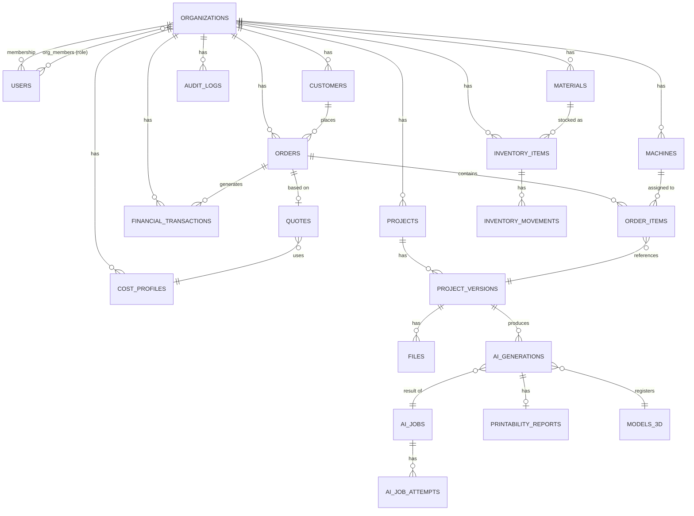

# 3D AI Studio — Banco de Dados

Schema PostgreSQL 16. Convenções: chave primária `UUID DEFAULT gen_random_uuid()` (extensão `pgcrypto`), toda entidade pertencente a um tenant tem `organization_id UUID NOT NULL REFERENCES organizations(id)` com índice, timestamps `created_at`/`updated_at` (trigger `updated_at`), soft delete via `deleted_at NULL` onde aplicável (nunca hard delete de dados financeiros/pedidos).

## Diagrama ER (visão macro)

## Tabelas principais

### organizations

| Coluna | Tipo | Notas |
|---|---|---|
| id | UUID PK | |
| name | TEXT NOT NULL | |
| slug | TEXT UNIQUE NOT NULL | usado em URLs/subdomínio futuro |
| plan | TEXT NOT NULL DEFAULT 'free' | free / pro / enterprise |
| settings | JSONB DEFAULT '{}' | preferências gerais, moeda, timezone |
| created_at, updated_at | TIMESTAMPTZ | |

### users

| Coluna | Tipo | Notas |
|---|---|---|
| id | UUID PK | |
| email | TEXT UNIQUE NOT NULL | |
| password_hash | TEXT NOT NULL | Argon2id |
| full_name | TEXT | |
| email_verified_at | TIMESTAMPTZ NULL | |
| is_active | BOOLEAN DEFAULT true | |
| created_at, updated_at | TIMESTAMPTZ | |

Sem `organization_id` direto — um usuário pode pertencer a múltiplas organizações via `org_members`.

### org_members

| Coluna | Tipo | Notas |
|---|---|---|
| id | UUID PK | |
| organization_id | UUID FK → organizations | |
| user_id | UUID FK → users | |
| role | TEXT NOT NULL | OWNER / ADMIN / MANAGER / OPERATOR / VIEWER |
| invited_by | UUID FK → users NULL | |
| created_at | TIMESTAMPTZ | |

`UNIQUE (organization_id, user_id)`.

### roles / permissions (RBAC customizável — fase Enterprise)

| Tabela | Colunas principais |
|---|---|
| `permissions` | `id`, `code` (ex. `orders:create`), `description` |
| `role_permissions` | `organization_id NULL` (NULL = papel padrão global), `role`, `permission_id` |

### projects

| Coluna | Tipo | Notas |
|---|---|---|
| id | UUID PK | |
| organization_id | UUID FK NOT NULL | índice |
| customer_id | UUID FK → customers NULL | |
| name | TEXT NOT NULL | |
| description | TEXT | |
| status | TEXT NOT NULL DEFAULT 'draft' | draft / in_progress / completed / archived |
| created_by | UUID FK → users | |
| created_at, updated_at, deleted_at | TIMESTAMPTZ | |

### project_versions

| Coluna | Tipo | Notas |
|---|---|---|
| id | UUID PK | |
| project_id | UUID FK NOT NULL | |
| version_number | INTEGER NOT NULL | sequencial por projeto |
| label | TEXT | ex. "v3 — furo ajustado" |
| prompt | TEXT NULL | prompt original do usuário, se aplicável |
| source_type | TEXT NOT NULL | `text_generative` / `image_to_3d` / `parametric_cad` / `manual_upload` / `mesh_edit` |
| ai_generation_id | UUID FK → ai_generations NULL | |
| status | TEXT NOT NULL | draft / generating / ready / failed |
| created_by | UUID FK → users | |
| created_at | TIMESTAMPTZ | |

`UNIQUE (project_id, version_number)`. Permite "voltar para v2" apontando o projeto ativo para outra versão sem apagar as demais.

### files

| Coluna | Tipo | Notas |
|---|---|---|
| id | UUID PK | |
| organization_id | UUID FK NOT NULL | |
| project_id | UUID FK → projects NULL | |
| project_version_id | UUID FK → project_versions NULL | |
| kind | TEXT NOT NULL | `source_image` / `model_stl` / `model_obj` / `model_glb` / `model_3mf` / `model_step` / `preview` / `document` |
| storage_key | TEXT NOT NULL | caminho no object storage |
| sha256_hash | TEXT NOT NULL | índice, deduplicação |
| mime_type | TEXT NOT NULL | |
| size_bytes | BIGINT NOT NULL | |
| uploaded_by | UUID FK → users NULL | |
| created_at | TIMESTAMPTZ | |

Índice em `(organization_id, sha256_hash)`.

### ai_jobs

| Coluna | Tipo | Notas |
|---|---|---|
| id | UUID PK | |
| organization_id | UUID FK NOT NULL | |
| project_id | UUID FK → projects NULL | |
| requested_by | UUID FK → users | |
| task_type | TEXT NOT NULL | `TEXT_TO_GENERATIVE_3D` / `IMAGE_TO_3D` / `PARAMETRIC_CAD` / `SIGN_TEXT_3D` / `MESH_REPAIR` / `MESH_EDIT` |
| input_spec | JSONB NOT NULL | `StructuredSpecification` serializado |
| status | TEXT NOT NULL DEFAULT 'QUEUED' | QUEUED / PROCESSING / VALIDATING / COMPLETED / FAILED / CANCELLED |
| queue_name | TEXT NOT NULL | |
| idempotency_key | TEXT NOT NULL | hash(spec+input) — índice único junto com organization_id |
| error_message | TEXT NULL | |
| created_at, started_at, finished_at | TIMESTAMPTZ | |

`UNIQUE (organization_id, idempotency_key)`.

### ai_job_attempts

| Coluna | Tipo | Notas |
|---|---|---|
| id | UUID PK | |
| ai_job_id | UUID FK NOT NULL | |
| provider_name | TEXT NOT NULL | ex. `hunyuan3d`, `trellis`, `openscad_cad` |
| attempt_number | INTEGER NOT NULL | |
| status | TEXT NOT NULL | SUCCEEDED / FAILED / TIMEOUT |
| error_detail | TEXT NULL | |
| duration_ms | INTEGER NULL | |
| compute_provider | TEXT NULL | LOCAL_GPU / CLOUD_GPU / CPU |
| created_at | TIMESTAMPTZ | |

Auditoria completa do fallback (seção 8 do ARCHITECTURE.md).

### ai_generations

| Coluna | Tipo | Notas |
|---|---|---|
| id | UUID PK | |
| ai_job_id | UUID FK NOT NULL | |
| organization_id | UUID FK NOT NULL | |
| provider_used | TEXT NOT NULL | |
| parameters | JSONB NOT NULL | parâmetros efetivamente usados na geração |
| result_file_id | UUID FK → files NULL | |
| preview_file_id | UUID FK → files NULL | GLB para viewer |
| processing_log | JSONB DEFAULT '[]' | pipeline de Mesh Processing aplicado, passo a passo |
| volume_mm3 | NUMERIC NULL | |
| bounding_box | JSONB NULL | `{x,y,z}` mm |
| created_at | TIMESTAMPTZ | |

### models_3d

Catálogo/registro reutilizável de resultados (para reuso/cache — seção "custo de IA"):

| Coluna | Tipo | Notas |
|---|---|---|
| id | UUID PK | |
| organization_id | UUID FK NOT NULL | |
| ai_generation_id | UUID FK NOT NULL | |
| input_hash | TEXT NOT NULL | hash da spec normalizada, para cache/reuso |
| file_id | UUID FK → files NOT NULL | |
| created_at | TIMESTAMPTZ | |

Índice em `(organization_id, input_hash)` para permitir "já geramos algo equivalente a isso antes?".

### printability_reports

| Coluna | Tipo | Notas |
|---|---|---|
| id | UUID PK | |
| ai_generation_id | UUID FK NOT NULL | |
| is_manifold | BOOLEAN | |
| is_watertight | BOOLEAN | |
| issues | JSONB NOT NULL | lista de problemas concretos (seção 12 ARCHITECTURE.md) |
| auto_fixed_issue_codes | JSONB DEFAULT '[]' | |
| created_at | TIMESTAMPTZ | |

### customers

| Coluna | Tipo | Notas |
|---|---|---|
| id | UUID PK | |
| organization_id | UUID FK NOT NULL | |
| name | TEXT NOT NULL | |
| email | TEXT NULL | |
| phone | TEXT NULL | |
| document | TEXT NULL | CPF/CNPJ quando aplicável, armazenar cifrado em repouso se exigido por compliance |
| address | JSONB NULL | |
| notes | TEXT NULL | |
| created_at, updated_at, deleted_at | TIMESTAMPTZ | |

### machines

| Coluna | Tipo | Notas |
|---|---|---|
| id | UUID PK | |
| organization_id | UUID FK NOT NULL | |
| name | TEXT NOT NULL | |
| brand | TEXT | |
| model | TEXT | |
| technology | TEXT NOT NULL | FDM / SLA / MSLA |
| build_volume_x_mm, build_volume_y_mm, build_volume_z_mm | NUMERIC | |
| power_watts | NUMERIC | |
| cost_per_hour | NUMERIC | usado na Calculadora |
| speed_profile | JSONB NULL | |
| compatible_materials | JSONB NULL | lista de `material_id` ou tags |
| status | TEXT NOT NULL DEFAULT 'active' | active / maintenance / inactive |
| created_at, updated_at | TIMESTAMPTZ | |

### materials

| Coluna | Tipo | Notas |
|---|---|---|
| id | UUID PK | |
| organization_id | UUID FK NOT NULL | |
| name | TEXT NOT NULL | ex. "PLA Branco" |
| type | TEXT NOT NULL | PLA / PETG / ABS / Resina / ... |
| color | TEXT | |
| density_g_cm3 | NUMERIC | usado no cálculo de peso |
| cost_per_kg | NUMERIC | |
| supplier | TEXT NULL | |
| created_at, updated_at | TIMESTAMPTZ | |

### inventory_items

| Coluna | Tipo | Notas |
|---|---|---|
| id | UUID PK | |
| organization_id | UUID FK NOT NULL | |
| material_id | UUID FK → materials NULL | filamentos/resinas |
| name | TEXT NOT NULL | genérico: bicos, mesas, ímãs, argolas, embalagens... |
| category | TEXT NOT NULL | filament / resin / component / packaging / spare_part |
| quantity_on_hand | NUMERIC NOT NULL DEFAULT 0 | |
| unit | TEXT NOT NULL | g / kg / un |
| minimum_stock | NUMERIC DEFAULT 0 | usado para alertas |
| unit_cost | NUMERIC | |
| supplier | TEXT NULL | |
| created_at, updated_at | TIMESTAMPTZ | |

### inventory_movements

| Coluna | Tipo | Notas |
|---|---|---|
| id | UUID PK | |
| inventory_item_id | UUID FK NOT NULL | |
| organization_id | UUID FK NOT NULL | |
| type | TEXT NOT NULL | entrada / saida / ajuste / consumo / perda |
| quantity | NUMERIC NOT NULL | positivo ou negativo conforme tipo |
| reference_order_id | UUID FK → orders NULL | vincula consumo a um pedido |
| unit_cost | NUMERIC NULL | |
| notes | TEXT NULL | |
| created_by | UUID FK → users | |
| created_at | TIMESTAMPTZ | |

### cost_profiles

| Coluna | Tipo | Notas |
|---|---|---|
| id | UUID PK | |
| organization_id | UUID FK NOT NULL | |
| name | TEXT NOT NULL | ex. "Padrão", "Atacado" |
| energy_cost_per_kwh | NUMERIC | |
| labor_cost_per_hour | NUMERIC | |
| packaging_cost_flat | NUMERIC | |
| waste_percentage | NUMERIC | |
| fees_percentage | NUMERIC | |
| profit_margin_percentage | NUMERIC | |
| tax_percentage | NUMERIC NULL | |
| is_default | BOOLEAN DEFAULT false | |
| created_at, updated_at | TIMESTAMPTZ | |

### quotes

| Coluna | Tipo | Notas |
|---|---|---|
| id | UUID PK | |
| organization_id | UUID FK NOT NULL | |
| customer_id | UUID FK → customers NULL | |
| project_version_id | UUID FK → project_versions NULL | |
| cost_profile_id | UUID FK → cost_profiles NOT NULL | |
| cost_breakdown_snapshot | JSONB NOT NULL | snapshot imutável dos valores usados no cálculo |
| production_cost | NUMERIC NOT NULL | |
| suggested_price | NUMERIC NOT NULL | |
| final_price | NUMERIC NULL | caso negociado |
| status | TEXT NOT NULL DEFAULT 'draft' | draft / sent / accepted / rejected / expired |
| created_at, updated_at | TIMESTAMPTZ | |

### orders

| Coluna | Tipo | Notas |
|---|---|---|
| id | UUID PK | |
| organization_id | UUID FK NOT NULL | |
| customer_id | UUID FK → customers NOT NULL | |
| quote_id | UUID FK → quotes NULL | |
| status | TEXT NOT NULL DEFAULT 'quote' | quote / order / paid / production / printing / finishing / packaging / delivered / completed / cancelled |
| total_amount | NUMERIC NOT NULL DEFAULT 0 | |
| notes | TEXT NULL | |
| created_at, updated_at | TIMESTAMPTZ | |

### order_items

| Coluna | Tipo | Notas |
|---|---|---|
| id | UUID PK | |
| order_id | UUID FK NOT NULL | |
| organization_id | UUID FK NOT NULL | |
| project_version_id | UUID FK → project_versions NULL | |
| machine_id | UUID FK → machines NULL | |
| material_id | UUID FK → materials NULL | |
| quantity | INTEGER NOT NULL DEFAULT 1 | |
| unit_cost | NUMERIC NULL | |
| unit_price | NUMERIC NULL | |
| status | TEXT NOT NULL DEFAULT 'pending' | pending / printing / done / failed |
| created_at, updated_at | TIMESTAMPTZ | |

### financial_transactions

| Coluna | Tipo | Notas |
|---|---|---|
| id | UUID PK | |
| organization_id | UUID FK NOT NULL | |
| type | TEXT NOT NULL | receita / custo / despesa |
| category | TEXT NOT NULL | ex. "material", "energia", "marketing" |
| cost_center | TEXT NULL | |
| amount | NUMERIC NOT NULL | |
| reference_order_id | UUID FK → orders NULL | |
| due_date | DATE NULL | contas a pagar/receber |
| paid_at | TIMESTAMPTZ NULL | |
| created_at, updated_at | TIMESTAMPTZ | |

Regra: `receita`, `custo` e `despesa` nunca se misturam na mesma linha — sempre discriminados por `type`, permitindo relatório de lucro = Σreceita − Σcusto − Σdespesa sem lógica condicional escondida.

### notifications

| Coluna | Tipo | Notas |
|---|---|---|
| id | UUID PK | |
| organization_id | UUID FK NOT NULL | |
| user_id | UUID FK → users NOT NULL | |
| type | TEXT NOT NULL | ai_job_completed / low_stock / order_status_changed / ... |
| payload | JSONB NOT NULL | |
| read_at | TIMESTAMPTZ NULL | |
| created_at | TIMESTAMPTZ | |

### audit_logs

| Coluna | Tipo | Notas |
|---|---|---|
| id | UUID PK | |
| organization_id | UUID FK NULL | NULL para ações de plataforma |
| user_id | UUID FK → users NULL | |
| action | TEXT NOT NULL | `login`, `role_changed`, `record_deleted`, `data_exported`, ... |
| entity_type | TEXT NULL | |
| entity_id | UUID NULL | |
| metadata | JSONB DEFAULT '{}' | |
| ip_address | INET NULL | |
| created_at | TIMESTAMPTZ | |

## Índices e constraints obrigatórios (checklist de revisão de toda migration)

- Toda FK para `organizations` tem índice.
- Toda tabela de tenant tem índice composto `(organization_id, created_at)` para listagens paginadas.
- `UNIQUE (organization_id, <campo de negócio único>)` em vez de `UNIQUE (<campo>)` global, onde fizer sentido (ex. não se aplica a `users.email`, que é global de plataforma).
- Nenhuma FK cross-tenant é permitida — validado em testes de integração (`order_items.machine_id` deve pertencer à mesma `organization_id` do pedido, verificado por constraint de aplicação + teste, já que Postgres não expressa isso nativamente sem trigger).
- Row-Level Security habilitado nas tabelas listadas acima usando `current_setting('app.current_org_id')`, como segunda camada (ver ARCHITECTURE.md §6).

## Migrações

Alembic, uma migration por mudança lógica (nunca squash de múltiplas features numa migration), sempre reversível (`downgrade` implementado), rodada automaticamente em CI contra banco efêmero antes de qualquer merge.
