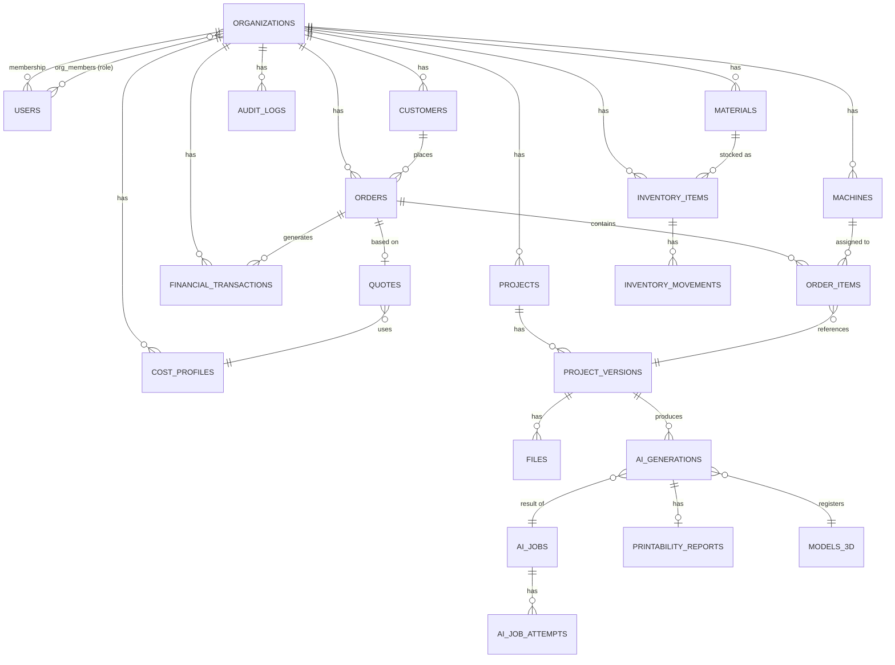

# 3D AI Studio — Banco de Dados

Schema PostgreSQL 16. Convenções: chave primária `UUID DEFAULT gen_random_uuid()` (extensão `pgcrypto`), toda entidade pertencente a um tenant tem `organization_id UUID NOT NULL REFERENCES organizations(id)` com índice, timestamps `created_at`/`updated_at` (trigger `updated_at`), soft delete via `deleted_at NULL` onde aplicável (nunca hard delete de dados financeiros/pedidos).

## Diagrama ER (visão macro)

## Tabelas principais

### organizations

| Coluna | Tipo | Notas |
|---|---|---|
| id | UUID PK | |
| name | TEXT NOT NULL | |
| slug | TEXT UNIQUE NOT NULL | usado em URLs/subdomínio futuro |
| plan | TEXT NOT NULL DEFAULT 'free' | free / pro / enterprise |
| settings | JSONB DEFAULT '{}' | preferências gerais, moeda, timezone |
| created_at, updated_at | TIMESTAMPTZ | |

### users

| Coluna | Tipo | Notas |
|---|---|---|
| id | UUID PK | |
| email | TEXT UNIQUE NOT NULL | |
| password_hash | TEXT NOT NULL | Argon2id |
| full_name | TEXT | |
| email_verified_at | TIMESTAMPTZ NULL | |
| is_active | BOOLEAN DEFAULT true | |
| created_at, updated_at | TIMESTAMPTZ | |

Sem `organization_id` direto — um usuário pode pertencer a múltiplas organizações via `org_members`.

### org_members

| Coluna | Tipo | Notas |
|---|---|---|
| id | UUID PK | |
| organization_id | UUID FK → organizations | |
| user_id | UUID FK → users | |
| role | TEXT NOT NULL | OWNER / ADMIN / MANAGER / OPERATOR / VIEWER |
| invited_by | UUID FK → users NULL | |
| created_at | TIMESTAMPTZ | |

`UNIQUE (organization_id, user_id)`.

### refresh_tokens

*(Adicionada na Fase 2 — não estava no desenho inicial, necessária para "logout" ser real: um refresh token JWT stateless não pode ser revogado antes de expirar.)*

| Coluna | Tipo | Notas |
|---|---|---|
| id | UUID PK | |
| user_id | UUID FK → users NOT NULL | |
| token_hash | TEXT UNIQUE NOT NULL | SHA-256 do token; o valor em texto puro nunca é persistido |
| expires_at | TIMESTAMPTZ NOT NULL | |
| revoked_at | TIMESTAMPTZ NULL | setado no logout ou na rotação (refresh) |
| created_at | TIMESTAMPTZ | |

Login e `/auth/refresh` emitem um access token JWT stateless (15 min) e um refresh token opaco (rotativo, cookie httpOnly), cujo hash é a única coisa gravada aqui — permite revogação real no logout, o que um JWT puro não permitiria sem uma blocklist.

### roles / permissions (RBAC customizável — fase Enterprise)

| Tabela | Colunas principais |
|---|---|
| `permissions` | `id`, `code` (ex. `orders:create`), `description` |
| `role_permissions` | `organization_id NULL` (NULL = papel padrão global), `role`, `permission_id` |

### projects

*(Implementada na Fase 3. `customer_id` foi adicionado na Fase 13, numa migration própria, agora que `customers` existe — nullable, um projeto pode não ter cliente vinculado. `active_version_id` foi adicionado — não estava no desenho original — para o projeto apontar para sua versão "atual" sem precisar de uma subquery a cada leitura.)*

| Coluna | Tipo | Notas |
|---|---|---|
| id | UUID PK | |
| organization_id | UUID FK NOT NULL | índice |
| name | TEXT NOT NULL | |
| description | TEXT NULL | |
| status | TEXT NOT NULL DEFAULT 'draft' | draft / in_progress / completed / archived |
| active_version_id | UUID FK → project_versions NULL | FK circular com `project_versions`, criada via `ALTER TABLE` após as duas tabelas existirem |
| created_by | UUID FK → users NULL | |
| created_at, updated_at, deleted_at | TIMESTAMPTZ | soft delete: `deleted_at` |

### project_versions

*(`prompt` e `ai_generation_id` ficam de fora até a Fase 4 — não há geração por IA ainda, só upload manual. `source_type` já aceita o valor futuro sem migration de schema, é `TEXT`.)*

| Coluna | Tipo | Notas |
|---|---|---|
| id | UUID PK | |
| project_id | UUID FK NOT NULL | índice |
| version_number | INTEGER NOT NULL | sequencial por projeto, calculado em `next_version_number` |
| label | TEXT NULL | ex. "v3 — furo ajustado" |
| source_type | TEXT NOT NULL DEFAULT 'manual_upload' | `manual_upload` por ora; `text_generative` / `image_to_3d` / `parametric_cad` / `mesh_edit` entram na Fase 4+ |
| status | TEXT NOT NULL DEFAULT 'draft' | draft / ready |
| created_by | UUID FK → users NULL | |
| created_at | TIMESTAMPTZ | |

`UNIQUE (project_id, version_number)`. Permite "voltar para v2" apontando `projects.active_version_id` para outra versão sem apagar as demais.

### files

*(`sha256_hash` e `size_bytes` são NULL até a confirmação do upload — ver fluxo abaixo. Coluna `status` adicionada — não estava no desenho original — para modelar o ciclo `pending` → `uploaded` do upload direto ao object storage.)*

| Coluna | Tipo | Notas |
|---|---|---|
| id | UUID PK | |
| organization_id | UUID FK NOT NULL | |
| project_id | UUID FK → projects NULL | |
| project_version_id | UUID FK → project_versions NULL | setado apenas quando o arquivo é anexado a uma versão |
| kind | TEXT NOT NULL | `source_image` / `model_stl` / `model_obj` / `model_glb` / `model_3mf` / `model_step` / `preview` / `document` |
| storage_key | TEXT NOT NULL UNIQUE | caminho no object storage: `org/{organization_id}/project/{project_id}/{file_id}{ext}` |
| sha256_hash | TEXT NULL | reservado para deduplicação — cálculo ainda não implementado (exigiria baixar o arquivo; ver Fase 8/Mesh Processing) |
| mime_type | TEXT NOT NULL | |
| size_bytes | BIGINT NULL | preenchido no `confirm` (HEAD no object storage) |
| status | TEXT NOT NULL DEFAULT 'pending' | `pending` (URL de upload emitida) → `uploaded` (confirmado) |
| uploaded_by | UUID FK → users NULL | |
| created_at | TIMESTAMPTZ | |

Fluxo de upload: `POST .../files/upload-url` cria a linha (`status='pending'`) e devolve uma URL pré-assinada de `PUT`; o cliente envia os bytes direto ao object storage; `POST .../files/{id}/confirm` faz um `HEAD` no storage para confirmar existência e tamanho, e só então marca `status='uploaded'`. Uma versão só pode ser criada a partir de um arquivo `uploaded`.

### ai_jobs

*(Implementada na Fase 4, só com providers mock. `task_type` por ora só assume `PARAMETRIC_CAD` e `TEXT_TO_GENERATIVE_3D` — os demais valores chegam junto do módulo que os implementa de verdade: `IMAGE_TO_3D` na Fase 6, `SIGN_TEXT_3D`/`MESH_EDIT` depois disso. `result_file_id`/`result_project_version_id` foram adicionados aqui — não estavam no desenho original, que previa uma tabela `ai_generations` separada para isso; como a Fase 4 não tem ainda volume/bounding_box/processing_log reais para justificar essa tabela (isso é Mesh Processing, Fase 8), o resultado do job aponta direto para `files`/`project_versions`. `ai_generations` e `models_3d` entram quando essa riqueza de dados existir de verdade.)*

| Coluna | Tipo | Notas |
|---|---|---|
| id | UUID PK | |
| organization_id | UUID FK NOT NULL | |
| project_id | UUID FK → projects NULL | |
| requested_by | UUID FK → users NULL | |
| task_type | TEXT NOT NULL | `PARAMETRIC_CAD` / `TEXT_TO_GENERATIVE_3D` / `IMAGE_TO_3D` (mais tipos em fases futuras) |
| input_spec | JSON NOT NULL | `{"prompt": ..., "spec": StructuredSpecification}` |
| source_image_file_id | UUID FK → files NULL | setado quando `task_type=IMAGE_TO_3D`; adicionada na Fase 6 |
| status | TEXT NOT NULL DEFAULT 'QUEUED' | QUEUED / PROCESSING / VALIDATING / COMPLETED / FAILED / CANCELLED — `VALIDATING` passou a ser usado de verdade na Fase 6 (`validate_generation_result`, sanidade estrutural básica); `CANCELLED` ainda não tem endpoint |
| queue_name | TEXT NOT NULL | `ai.cad` / `ai.generate` |
| idempotency_key | TEXT NOT NULL | sha256(prompt normalizado + project_id + image_file_id) — índice único junto com organization_id |
| error_message | TEXT NULL | |
| result_file_id | UUID FK → files NULL | |
| result_project_version_id | UUID FK → project_versions NULL | |
| result_metadata | JSON NULL | metadata do `GenerationResult` do provider (ex. `placeholder`/`development_only`/`note`) — adicionada na Fase 6 para o mock/stub nunca ficar disfarçado de geração real na API/UI. Para `model_stl`, a Fase 8 acrescenta a chave `mesh_quality` (`is_watertight`, `is_manifold`, `component_count`, `volume_mm3`, `area_mm2`, `repairs_applied`) vinda do `run_quality_pipeline` |
| created_at, started_at, finished_at | TIMESTAMPTZ | |

`UNIQUE (organization_id, idempotency_key)`.

### ai_job_attempts

*(`compute_provider` do desenho original foi deixado de fora por ora — só faz sentido distinguir LOCAL_GPU/CLOUD_GPU/CPU quando houver um provider real que de fato precise de GPU, o que só chega na Fase 5/6.)*

| Coluna | Tipo | Notas |
|---|---|---|
| id | UUID PK | |
| ai_job_id | UUID FK NOT NULL | |
| provider_name | TEXT NOT NULL | ex. `build123d_cad` (real, Fase 7), `mock_generative_unavailable`, `mock_generative_placeholder`, `mock_image_to_3d` — providers de imagem/texto real (`hunyuan3d`, `trellis`, ...) ainda pendentes de GPU/licença |
| attempt_number | INTEGER NOT NULL | |
| status | TEXT NOT NULL | SUCCEEDED / FAILED |
| error_detail | TEXT NULL | |
| duration_ms | INTEGER NULL | |
| created_at | TIMESTAMPTZ | |

Auditoria completa do fallback (seção 8 do ARCHITECTURE.md) — cada tentativa de cada provider é registrada, sucesso ou falha, nunca sobrescrita.

### ai_generations

| Coluna | Tipo | Notas |
|---|---|---|
| id | UUID PK | |
| ai_job_id | UUID FK NOT NULL | |
| organization_id | UUID FK NOT NULL | |
| provider_used | TEXT NOT NULL | |
| parameters | JSONB NOT NULL | parâmetros efetivamente usados na geração |
| result_file_id | UUID FK → files NULL | |
| preview_file_id | UUID FK → files NULL | GLB para viewer |
| processing_log | JSONB DEFAULT '[]' | pipeline de Mesh Processing aplicado, passo a passo |
| volume_mm3 | NUMERIC NULL | |
| bounding_box | JSONB NULL | `{x,y,z}` mm |
| created_at | TIMESTAMPTZ | |

### models_3d

Catálogo/registro reutilizável de resultados (para reuso/cache — seção "custo de IA"):

| Coluna | Tipo | Notas |
|---|---|---|
| id | UUID PK | |
| organization_id | UUID FK NOT NULL | |
| ai_generation_id | UUID FK NOT NULL | |
| input_hash | TEXT NOT NULL | hash da spec normalizada, para cache/reuso |
| file_id | UUID FK → files NOT NULL | |
| created_at | TIMESTAMPTZ | |

Índice em `(organization_id, input_hash)` para permitir "já geramos algo equivalente a isso antes?".

### printability_reports

| Coluna | Tipo | Notas |
|---|---|---|
| id | UUID PK | |
| ai_generation_id | UUID FK NOT NULL | |
| is_manifold | BOOLEAN | |
| is_watertight | BOOLEAN | |
| issues | JSONB NOT NULL | lista de problemas concretos (seção 12 ARCHITECTURE.md) |
| auto_fixed_issue_codes | JSONB DEFAULT '[]' | |
| created_at | TIMESTAMPTZ | |

### customers

| Coluna | Tipo | Notas |
|---|---|---|
| id | UUID PK | |
| organization_id | UUID FK NOT NULL | |
| name | TEXT NOT NULL | |
| email | TEXT NULL | |
| phone | TEXT NULL | |
| document | TEXT NULL | CPF/CNPJ quando aplicável, armazenar cifrado em repouso se exigido por compliance |
| address | JSONB NULL | |
| notes | TEXT NULL | |
| created_at, updated_at, deleted_at | TIMESTAMPTZ | |

*(Implementada na Fase 13 — ver ARCHITECTURE.md, nota "Status na Fase 13". `document` está em texto plano nesta implementação — a cifragem em repouso mencionada na nota original ainda não foi feita, ver a pendência de compliance sinalizada na mesma nota da ARCHITECTURE.md. Soft delete via `deleted_at`, mesmo padrão de `projects`.)*

### machines

| Coluna | Tipo | Notas |
|---|---|---|
| id | UUID PK | |
| organization_id | UUID FK NOT NULL | |
| name | TEXT NOT NULL | |
| brand | TEXT | |
| model | TEXT | |
| technology | TEXT NOT NULL | FDM / SLA / MSLA |
| build_volume_x_mm, build_volume_y_mm, build_volume_z_mm | NUMERIC | |
| power_watts | NUMERIC | |
| cost_per_hour | NUMERIC | usado na Calculadora |
| speed_profile | JSONB NULL | |
| compatible_materials | JSONB NULL | lista de `material_id` ou tags |
| status | TEXT NOT NULL DEFAULT 'active' | active / maintenance / inactive |
| created_at, updated_at | TIMESTAMPTZ | |

### materials

| Coluna | Tipo | Notas |
|---|---|---|
| id | UUID PK | |
| organization_id | UUID FK NOT NULL | |
| name | TEXT NOT NULL | ex. "PLA Branco" |
| type | TEXT NOT NULL | PLA / PETG / ABS / Resina / ... |
| color | TEXT | |
| density_g_cm3 | NUMERIC | usado no cálculo de peso |
| cost_per_kg | NUMERIC | |
| supplier | TEXT NULL | |
| created_at, updated_at | TIMESTAMPTZ | |

### inventory_items

| Coluna | Tipo | Notas |
|---|---|---|
| id | UUID PK | |
| organization_id | UUID FK NOT NULL | |
| material_id | UUID FK → materials NULL | filamentos/resinas |
| name | TEXT NOT NULL | genérico: bicos, mesas, ímãs, argolas, embalagens... |
| category | TEXT NOT NULL | filament / resin / component / packaging / spare_part |
| quantity_on_hand | NUMERIC NOT NULL DEFAULT 0 | |
| unit | TEXT NOT NULL | g / kg / un |
| minimum_stock | NUMERIC DEFAULT 0 | usado para alertas |
| unit_cost | NUMERIC | |
| supplier | TEXT NULL | |
| created_at, updated_at | TIMESTAMPTZ | |

### inventory_movements

| Coluna | Tipo | Notas |
|---|---|---|
| id | UUID PK | |
| inventory_item_id | UUID FK NOT NULL | |
| organization_id | UUID FK NOT NULL | |
| type | TEXT NOT NULL | entrada / saida / ajuste / consumo / perda |
| quantity | NUMERIC NOT NULL | positivo ou negativo conforme tipo |
| reference_order_id | UUID FK → orders NULL | vincula consumo a um pedido |
| unit_cost | NUMERIC NULL | |
| notes | TEXT NULL | |
| created_by | UUID FK → users | |
| created_at | TIMESTAMPTZ | |

*(`materials`, `inventory_items` e `inventory_movements` implementadas na Fase 12 — ver ARCHITECTURE.md, nota "Status na Fase 12" após o Roadmap. `reference_order_id` em `inventory_movements` ficou como coluna solta, sem `FOREIGN KEY`, até a Fase 14 criar `orders` — a constraint foi adicionada então, numa migration própria, mesmo padrão usado para `quotes.customer_id` (Fase 11 → 13). `density_g_cm3`/`cost_per_kg` em `materials` foram implementados como `NULL`-áveis — o desenho original não marcava `NOT NULL` explicitamente para eles.)*

### cost_profiles

| Coluna | Tipo | Notas |
|---|---|---|
| id | UUID PK | |
| organization_id | UUID FK NOT NULL | |
| name | TEXT NOT NULL | ex. "Padrão", "Atacado" |
| energy_cost_per_kwh | NUMERIC | |
| labor_cost_per_hour | NUMERIC | |
| packaging_cost_flat | NUMERIC | |
| waste_percentage | NUMERIC | |
| fees_percentage | NUMERIC | |
| profit_margin_percentage | NUMERIC | |
| tax_percentage | NUMERIC NULL | |
| is_default | BOOLEAN DEFAULT false | |
| created_at, updated_at | TIMESTAMPTZ | |

### quotes

| Coluna | Tipo | Notas |
|---|---|---|
| id | UUID PK | |
| organization_id | UUID FK NOT NULL | |
| customer_id | UUID FK → customers NULL | |
| project_version_id | UUID FK → project_versions NULL | |
| cost_profile_id | UUID FK → cost_profiles NOT NULL | |
| cost_breakdown_snapshot | JSONB NOT NULL | snapshot imutável dos valores usados no cálculo |
| production_cost | NUMERIC NOT NULL | |
| suggested_price | NUMERIC NOT NULL | |
| final_price | NUMERIC NULL | caso negociado |
| status | TEXT NOT NULL DEFAULT 'draft' | draft / sent / accepted / rejected / expired |
| created_by | UUID FK → users NULL | quem criou o orçamento — não estava no desenho original, adicionado por consistência com toda outra entidade auditável (`Project.created_by`, `AIJob.requested_by`, ...) |
| created_at, updated_at | TIMESTAMPTZ | |

*(`cost_profiles` e `quotes` implementadas na Fase 11, junto com `domain/calculator/` — ver ARCHITECTURE.md §14. `customer_id` em `quotes` ficou como coluna solta, sem `FOREIGN KEY`, até a Fase 13 criar `customers` — a constraint foi adicionada então, numa migration própria. Todo cálculo é 100% determinístico — nenhum campo aqui é preenchido por IA generativa, só por quem cria o orçamento.)*

### orders

| Coluna | Tipo | Notas |
|---|---|---|
| id | UUID PK | |
| organization_id | UUID FK NOT NULL | |
| customer_id | UUID FK → customers NOT NULL | |
| quote_id | UUID FK → quotes NULL | |
| status | TEXT NOT NULL DEFAULT 'quote' | quote / order / paid / production / printing / finishing / packaging / delivered / completed / cancelled |
| total_amount | NUMERIC NOT NULL DEFAULT 0 | |
| notes | TEXT NULL | |
| created_by | UUID FK → users NULL | quem criou o pedido — mesmo padrão de auditoria de `quotes.created_by` (Fase 11), não estava no desenho original |
| created_at, updated_at | TIMESTAMPTZ | |

*(Implementada na Fase 14, junto com `order_items` e `domain/orders/` — ver ARCHITECTURE.md, nota "Status na Fase 14". `status` não tem `CHECK` no banco (SQLite) — a validação de transição válida é 100% em `domain/orders/status.py`, testada isoladamente.)*

### order_items

| Coluna | Tipo | Notas |
|---|---|---|
| id | UUID PK | |
| order_id | UUID FK NOT NULL | |
| organization_id | UUID FK NOT NULL | |
| project_version_id | UUID FK → project_versions NULL | |
| machine_id | UUID FK → machines NULL | |
| material_id | UUID FK → materials NULL | |
| quantity | INTEGER NOT NULL DEFAULT 1 | |
| unit_cost | NUMERIC NULL | |
| unit_price | NUMERIC NULL | |
| status | TEXT NOT NULL DEFAULT 'pending' | pending / printing / done / failed |
| created_at, updated_at | TIMESTAMPTZ | |

*(`machine_id` existe como coluna solta, sem `FOREIGN KEY`, porque `machines` ainda não existe — Fase 17; mesmo padrão adiado já usado antes para `quotes.customer_id`/`projects.customer_id`/`inventory_movements.reference_order_id`. `total_amount` de `orders` é recalculado por `domain/orders/totals.py::compute_total_amount` a cada item adicionado — nunca incrementado, para não acumular erro de arredondamento.)*

### financial_transactions

| Coluna | Tipo | Notas |
|---|---|---|
| id | UUID PK | |
| organization_id | UUID FK NOT NULL | |
| type | TEXT NOT NULL | receita / custo / despesa |
| category | TEXT NOT NULL | ex. "material", "energia", "marketing" |
| cost_center | TEXT NULL | |
| amount | NUMERIC NOT NULL | |
| reference_order_id | UUID FK → orders NULL | |
| due_date | DATE NULL | contas a pagar/receber |
| paid_at | TIMESTAMPTZ NULL | |
| created_at, updated_at | TIMESTAMPTZ | |

Regra: `receita`, `custo` e `despesa` nunca se misturam na mesma linha — sempre discriminados por `type`, permitindo relatório de lucro = Σreceita − Σcusto − Σdespesa sem lógica condicional escondida.

*(Implementada na Fase 15, junto com `domain/financial/summary.py` — ver ARCHITECTURE.md, nota "Status na Fase 15". `created_by` foi adicionado — não estava no desenho original — mesmo padrão de auditoria de `Quote.created_by`/`Order.created_by`. `reference_order_id` já nasceu com `FOREIGN KEY` de verdade (diferente de `quotes.customer_id`/`inventory_movements.reference_order_id`, que ficaram soltos por fases inteiras): `orders` já existia quando esta fase começou, então não havia lacuna a adiar.)*

### notifications

| Coluna | Tipo | Notas |
|---|---|---|
| id | UUID PK | |
| organization_id | UUID FK NOT NULL | |
| user_id | UUID FK → users NOT NULL | |
| type | TEXT NOT NULL | ai_job_completed / low_stock / order_status_changed / ... |
| payload | JSONB NOT NULL | |
| read_at | TIMESTAMPTZ NULL | |
| created_at | TIMESTAMPTZ | |

### audit_logs

| Coluna | Tipo | Notas |
|---|---|---|
| id | UUID PK | |
| organization_id | UUID FK NULL | NULL para ações de plataforma |
| user_id | UUID FK → users NULL | |
| action | TEXT NOT NULL | `login`, `role_changed`, `record_deleted`, `data_exported`, ... |
| entity_type | TEXT NULL | |
| entity_id | UUID NULL | |
| metadata | JSONB DEFAULT '{}' | |
| ip_address | INET NULL | |
| created_at | TIMESTAMPTZ | |

## Índices e constraints obrigatórios (checklist de revisão de toda migration)

- Toda FK para `organizations` tem índice.
- Toda tabela de tenant tem índice composto `(organization_id, created_at)` para listagens paginadas.
- `UNIQUE (organization_id, <campo de negócio único>)` em vez de `UNIQUE (<campo>)` global, onde fizer sentido (ex. não se aplica a `users.email`, que é global de plataforma).
- Nenhuma FK cross-tenant é permitida — validado em testes de integração (`order_items.machine_id` deve pertencer à mesma `organization_id` do pedido, verificado por constraint de aplicação + teste, já que Postgres não expressa isso nativamente sem trigger).
- Row-Level Security habilitado nas tabelas listadas acima usando `current_setting('app.current_org_id')`, como segunda camada (ver ARCHITECTURE.md §6).

## Migrações

Alembic, uma migration por mudança lógica (nunca squash de múltiplas features numa migration), sempre reversível (`downgrade` implementado), rodada automaticamente em CI contra banco efêmero antes de qualquer merge.
